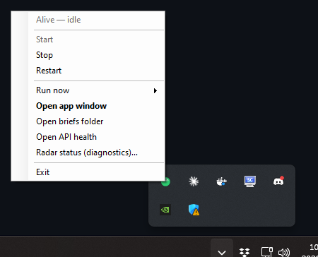
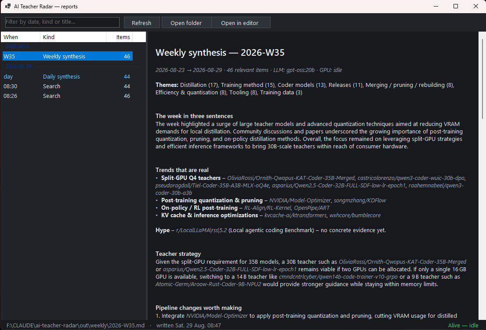
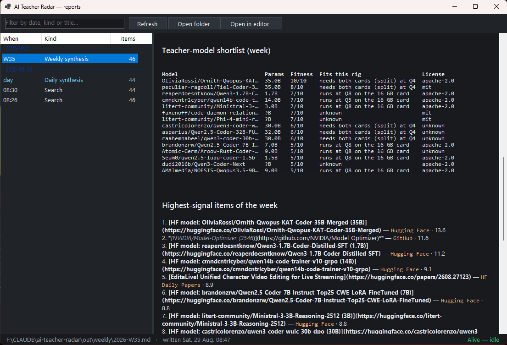
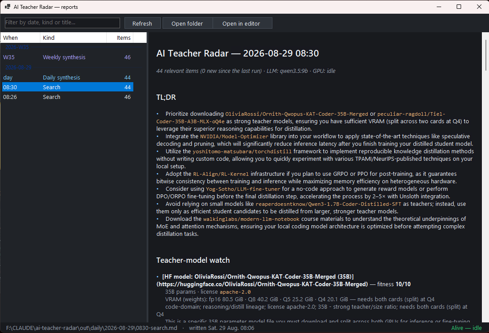
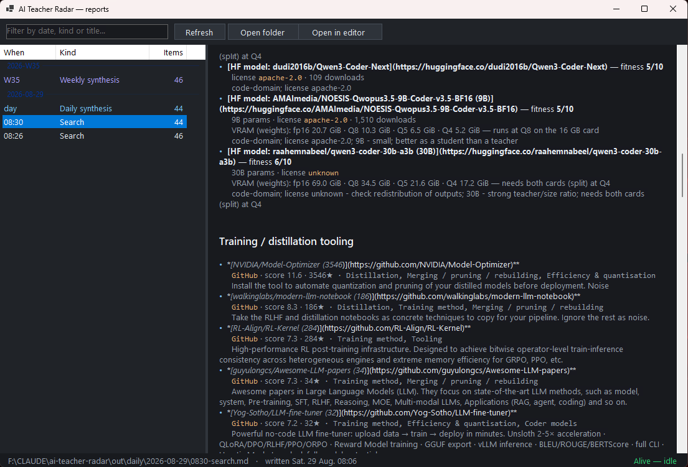
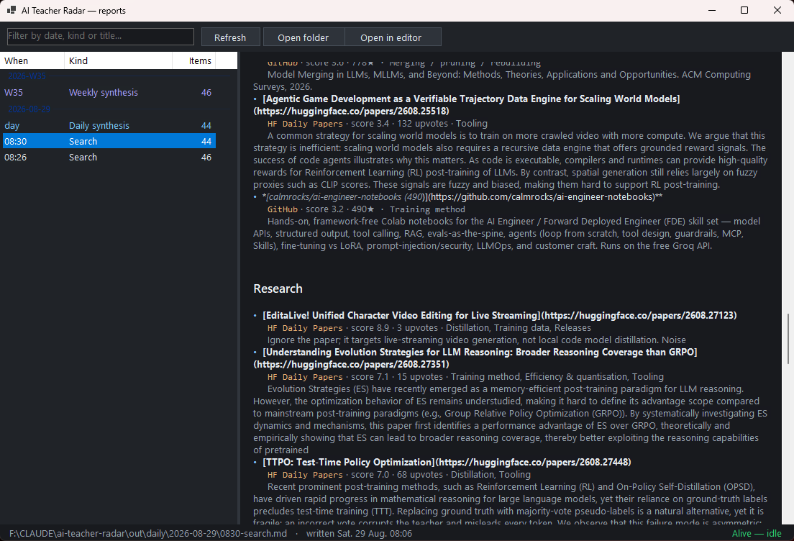
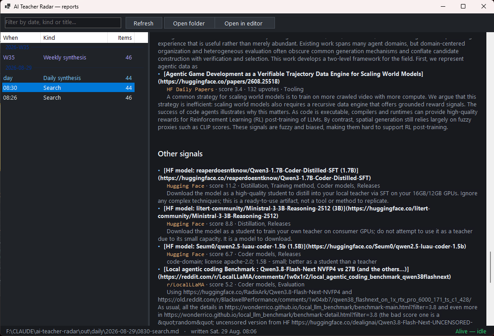

# AI Teacher Radar

A local, Dockerised news radar for one narrow beat: **how AI models are taught,
improved, created, distilled and rebuilt** — and which of it is worth doing on
your own two GPUs.

Four searches a day, a synthesis every night, a synthesis every week, all as
Markdown on disk. No cloud API, no keys required: sources are RSS/public APIs
and summarisation runs on your local Ollama.

It also knows when to stay out of the way. If the GPU is busy — a ComfyUI render,
a training run, someone else's Ollama session — the search still *harvests*, but
the written brief waits and says so, rather than fighting your video pipeline
for VRAM.

---

## What it produces

```
out/
├── daily/
│   └── 2026-08-29/
│       ├── 0600-search.md          one per scheduled search
│       ├── 1200-search.md
│       ├── 1800-search.md
│       ├── 2300-search.md
│       └── SYNTHESIS.md            the one you actually read
└── weekly/
    └── 2026-W35.md                 trends, teacher shortlist, pipeline changes
```

Every file has YAML front matter, so the folder drops straight into Obsidian.

Each brief is sectioned as: **inventory counts → TL;DR → Teacher-model
watch → Student-model watch → Training / distillation tooling → Research →
Noise / off-list → Source health**. A `*-search.json` sidecar sits next to
each Markdown brief (url, license, params, fitness, buckets, role,
`output_learning_allowed`) so Borg can ingest structured items.

The *Teacher-model watch* section is the point of the whole thing: new Hugging
Face models scored **0–10 for teacher fitness**, with a VRAM plan at fp16/Q8/Q5/Q4
and a verdict like *"runs at Q4 on the 16 GB card"*. See
[docs/TEACHER_MODELS.md](docs/TEACHER_MODELS.md) for the curated baseline list of
what to download and why.

---

## What it looks like

Everything below is real output from a single day's runs — no mock-ups. Briefs
are listed left, newest first; the rendered Markdown is on the right with
clickable links, and the bottom strip carries the file you are reading plus the
live radar state.

### The tray menu

Everything is driven from here. The greyed first line is the live radar state,
the same one the icon colour encodes. **Open app window** and double-clicking
the icon both open the reader; the diagnostics dashboard is deliberately a
separate, clearly-labelled entry.



### Weekly synthesis

Trends are only called out when at least two independent items back them, and
anything with a single item behind it gets named as hype rather than quietly
dropped. The *Teacher strategy* section reasons about what actually fits the
hardware.



### Teacher-model shortlist

Every candidate scored 0–10 for teacher fitness, with the VRAM verdict computed
from the parameter count rather than asserted — "needs both cards (split) at Q4"
versus "runs at Q8 on the 16 GB card" — plus the licence, because several strong
open-weight models restrict training on their outputs.



### A scheduled search brief

Each run opens with a TL;DR that names concrete actions, including what to
ignore, then the teacher-model watch with the full VRAM plan per model.



### Training and distillation tooling

New and updated frameworks, each with a one-line verdict on whether it is a
technique to copy, a tool to install, or noise.



### Research

Papers from arXiv and HF Daily Papers, scored and bucketed. Off-beat hits are
labelled as noise rather than padded out.



### Other signals

Everything else above threshold — models better suited as students than
teachers, community benchmarks, and the rest.



## Install

```bash
cd ai-teacher-radar
cp .env.example .env
docker compose up -d --build
```

Then confirm:

```bash
curl -s http://127.0.0.1:8791/health
```

Nothing else is required — the container self-schedules by default. Read on for
the n8n hand-off.

---

## Scheduling: n8n owns it

If you already run n8n, the radar defers to it rather than adding a second
scheduler to the machine.

The base `docker-compose.yml` deliberately declares **no external network**, so
it starts anywhere. To put the radar on n8n's network — which lets n8n reach it
at `http://ai-teacher-radar:8791` with no host round-trip — add the override:

```bash
docker compose -f docker-compose.yml -f docker-compose.n8n.yml up -d
```

RadarTray applies that override automatically, but only after checking the
network exists with `docker network inspect`. This matters: an external network
that is declared but absent makes `docker compose up` fail outright, so a fresh
install on a machine with no n8n would otherwise never start. Set `N8N_NETWORK`
in your `.env` if your n8n uses a different network name (the default is
`n8n_default`).

**Import the workflow:** n8n UI → *Workflows* → *Import from File* →
`n8n/ai-teacher-radar.workflow.json` → activate it.

It contains three cron triggers (4× daily search, nightly synthesis, weekly
synthesis), a GPU pre-check, and a branch that reports back whether the run
started or was deferred.

`SCHEDULER_MODE` decides what happens when n8n is *not* driving:

| Mode | Behaviour |
|---|---|
| `auto` *(default)* | The container self-schedules as a dead-man's switch: at each slot it waits `N8N_GRACE_MIN`, and fires only if no n8n job arrived. Importing or removing the workflow is safe either way. |
| `n8n` | Never self-schedule. If the workflow is off, nothing runs. |
| `internal` | Ignore n8n entirely. |

Jobs are tagged by origin (`n8n` / `internal` / `manual`) so you can always see
who fired what in `/jobs`.

---

## The GPU gate

Three independent probes, OR-ed. Any one saying *busy* defers the job:

1. **`nvidia-smi`** inside the container (the compose file reserves the NVIDIA
   devices) — busy above `GPU_BUSY_UTIL_PCT` utilisation or `GPU_BUSY_VRAM_MIB`
   of VRAM in use.
2. **ComfyUI `/queue`** — a running render is the honest signal even when VRAM
   momentarily looks calm.
3. **Ollama `/api/ps`** — a *foreign* model resident means someone else is
   mid-generation.

Each probe degrades to "unknown, not busy" instead of raising, so a stopped
ComfyUI or a missing `nvidia-smi` can never wedge the queue.

The gate is deliberately **asymmetric**:

- **Harvesting** is pure HTTP and runs regardless (`FETCH_WHEN_GPU_BUSY=true`).
  A search scheduled during a six-hour video render still captures everything
  published in that window.
- **The LLM pass** waits, rechecking every `GPU_RECHECK_S`, and drops a
  `HHMM-search.DEFERRED.md` note in the day's folder so the wait is visible on
  disk rather than silent. That file is replaced by the real brief when the GPU
  frees.
- After `GPU_MAX_DEFER_S` (default 6h) it gives up waiting and publishes a
  rule-based brief, noting that it did. You never lose a window entirely.

Check it any time:

```bash
curl -s http://127.0.0.1:8791/gpu
curl -s http://127.0.0.1:8791/queue
```

Only one job runs at a time. Parallelism would defeat the point.

---

## API

| Method | Path | Purpose |
|---|---|---|
| `GET` | `/health` | Status, LLM readiness, next scheduled runs |
| `GET` | `/gpu` | Live probe results and the gate policy |
| `POST` | `/jobs` | Enqueue `{"kind":"search"\|"daily"\|"weekly","slot":"12:00"}` |
| `GET` | `/jobs` | Job history (filter with `?state=deferred_gpu_busy`) |
| `GET` | `/queue` | What is waiting and why |
| `GET` | `/runs` | Run history with GPU wait times |
| `GET` | `/latest?kind=daily` | Most recent Markdown, as text |
| `GET` | `/latest?kind=search&format=json` | Latest search sidecar JSON |

Run one now:

```bash
curl -s -X POST http://127.0.0.1:8791/jobs -H "content-type: application/json" -d "{\"kind\":\"search\"}"
```

`scripts/radar.ps1` wraps all of this (`.\scripts\radar.ps1 search|daily|weekly|gpu|queue|health|logs`).

---

## Tuning

Sources live in [`config/sources.yaml`](config/sources.yaml) — 28 feeds plus
arXiv, GitHub search, Hacker News and the Hugging Face model/paper APIs. Set
`enabled: false` on anything noisy; `weight` multiplies an item's score.

Relevance lives in [`config/keywords.yaml`](config/keywords.yaml) as weighted
buckets (distillation 3.0, training method 2.5, data 2.5, coder 2.5, model
surgery 2.0 …). An item's score is the sum of matched bucket weights × source
weight × a recency factor, plus bonuses for stars/points/upvotes and teacher
fitness. `SCORE_THRESHOLD` (default 3.0) decides what makes the brief.

Both files are bind-mounted, so edits apply on the next run — no rebuild.

Scoring runs **before** any LLM call, deliberately: the GPU is contended here,
so the cheap filter decides what is even worth a token.

### Models used

`LLM_MODEL` and `LLM_SYNTHESIS_MODEL` default to `gpt-oss:20b` and write notes
only when the GPU gate is idle. They never default to `qwen3.5:9b` (Borg's LoRA
student) or `qwen3.8:27b` (live search): if `.env` still names those tags, radar
remaps to `gpt-oss:20b` or publishes a rule-based brief. Both are unloaded
(`keep_alive: 0`) the moment a run finishes so a queued render or train is not
blocked. LLM actions are **review** or **ignore** — never download or pull.

Set `LLM_ENABLED=false` for a zero-GPU deployment: you still get harvesting,
scoring, dedup and rule-based briefs.

---

## Troubleshooting

**No GPU telemetry** — `docker compose exec ai-teacher-radar nvidia-smi`. If it
fails, comment out the `deploy.resources` block; the ComfyUI and Ollama probes
carry on alone.

**n8n cannot reach the service** — confirm both are on the same network:
`docker network inspect $N8N_NETWORK` (default `n8n_default`).

**GitHub source rate-limited** — unauthenticated search is 10 requests/minute.
Put a read-only PAT in `GITHUB_TOKEN` to get 30.

**Empty briefs** — lower `SCORE_THRESHOLD` or raise `LOOKBACK_HOURS`. Check
`/latest` for the *Source health* section; a feed that changed its URL shows up
there as `✗`.
